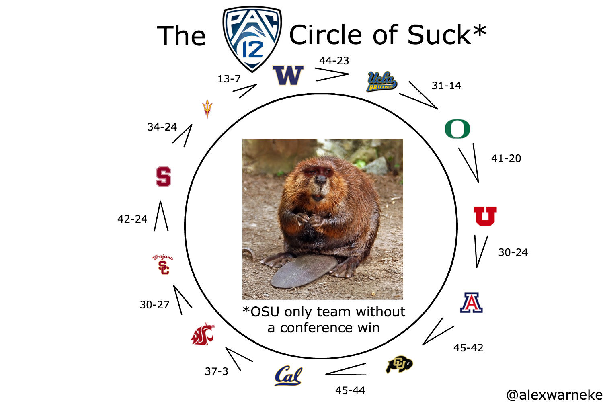

# PAC-12 longest simple cycle (aka circle of suck) (aka circle of doom)
Sample output
```
~$ ./longest_simple_cycle.py 
found 5127 simple cycle(s) (excluding dup wins)
found 286 simple cycle(s) with max len=12
Stanford         defeats UCLA            : 49-42
UCLA             defeats USC             : 34-27
USC              defeats Oregon State    : 38-21
Oregon State     defeats Colorado        : 41-34
Colorado         defeats Arizona State   : 28-21
Arizona State    defeats Arizona         : 41-40
Arizona          defeats Oregon          : 44-15
Oregon           defeats California      : 42-24
California       defeats Washington      : 12-10
Washington       defeats Washington State: 28-15
Washington State defeats Utah            : 28-24
Utah             defeats Stanford        : 40-21
pac12's largest circle of suck (len=12): ['UCLA', 'USC', 'Oregon State', 'Colorado', 'Arizona State', 'Arizona', 'Oregon', 'California', 'Washington', 'Washington State', 'Utah', 'Stanford']
```

### TODO
* parse and run https://www.masseyratings.com/scores.php?s=286577&sub=11590&all=1&mode=2&format=0

### Inspired by:

